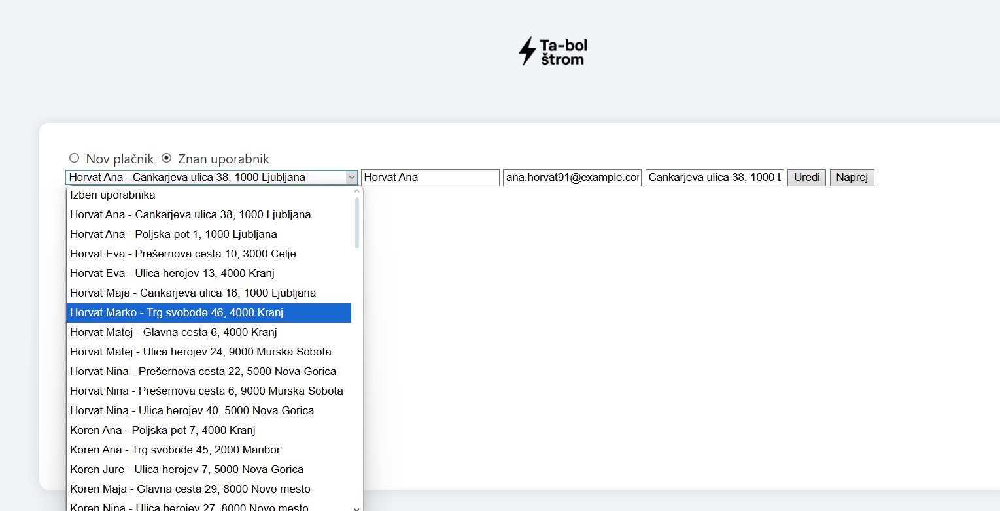
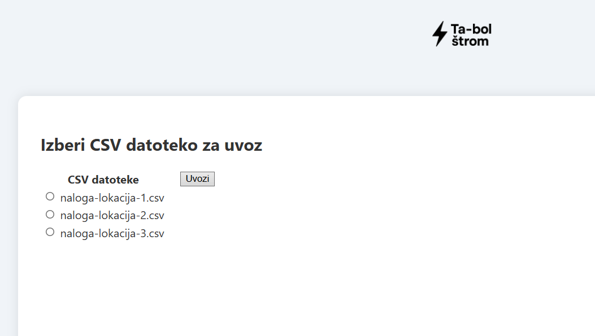
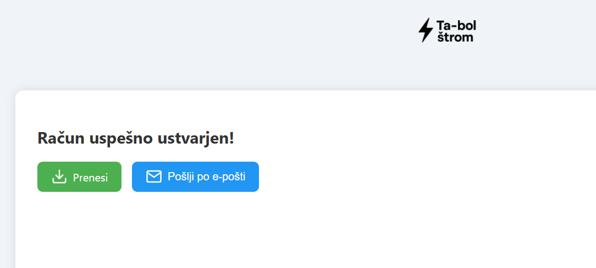

App za račune za podjetje Ta-bol štrom d. o. o.

Prva stran nam ponuja dve možnosti Ustvari nov račun, kjer generiramo nov račun ali pa pregled računov, ki so že v naši sql bazi:

Na naslednji strani, lahko dodamo novega uporabnika oziroma izberemo že starega uporabnika,  ki ga lahko tudi popravivo, če ga mamo izbranega in kliknemo na gumb Uredi. 
Podatki stranke so v obliki 
- Ime: Priimek Ime
- Email: elektronski naslov
- Naslov: ulica hišna številka, poštna številka mesto

Na naslednji strani označimo csv datoteko, ki pripada izbrani stranki (vse csv datoteke, ki so v pravem direktoriju), ko gremo naprej se račun tvori in shrani podatke v bazo.
 
Sedaj imate možnost downloadati ali pa poslati račun preko elektronske pošte. Račun tudi generira QR kodo, toda bančna aplikacija mi je noče prebrati.

Potem pa še stran za reporte, kjer lahko gledate stare račune.

