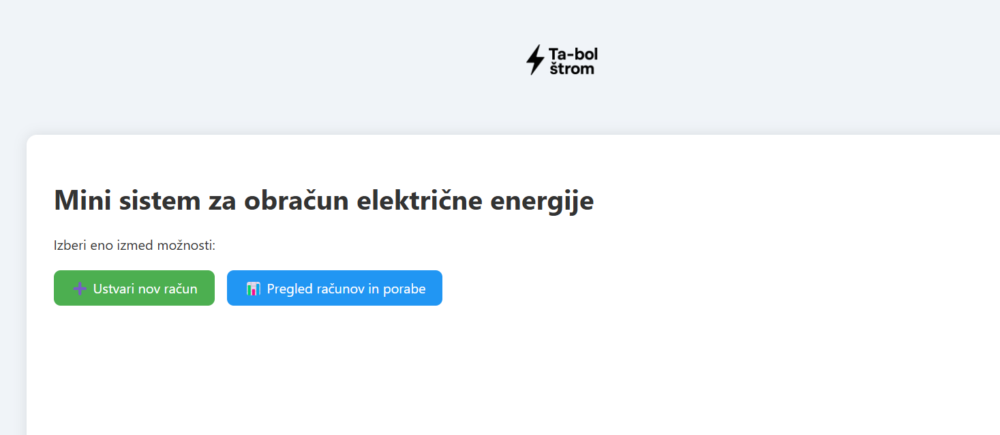
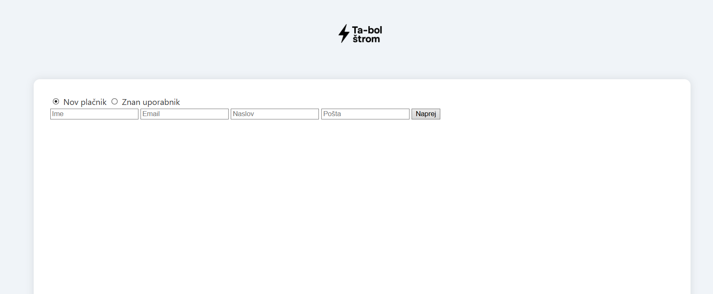
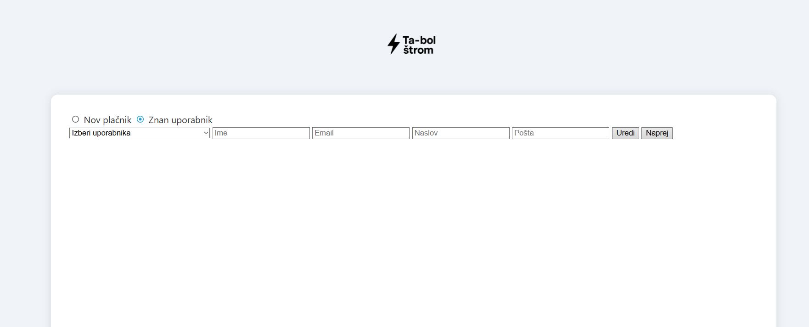
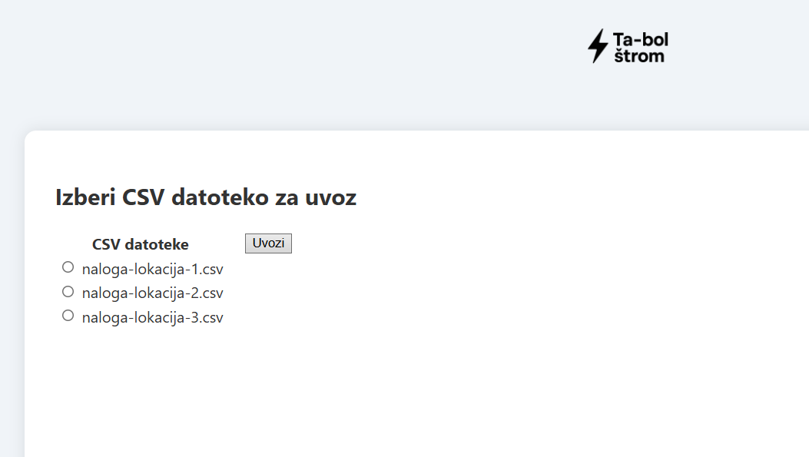
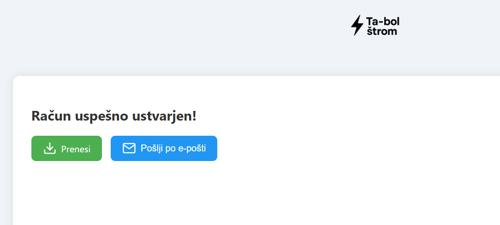
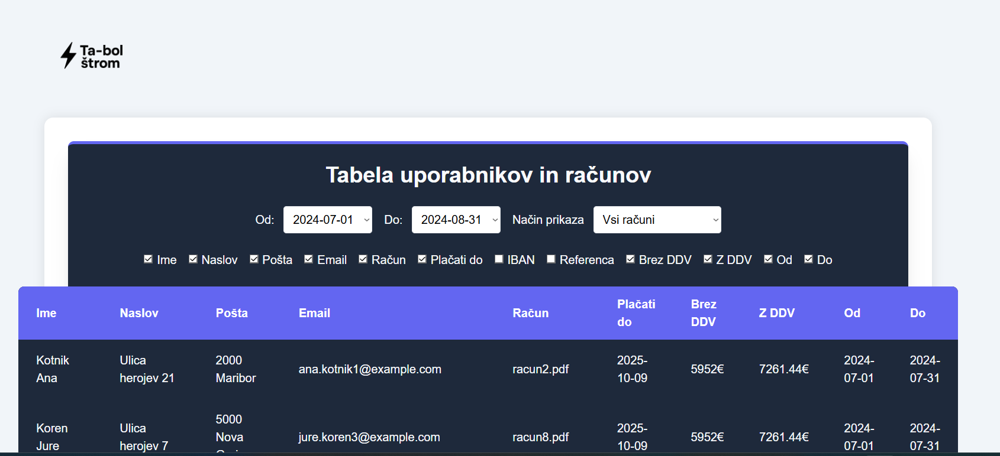

# ⚡ Ta-bol štrom d.o.o. – Invoice Application

This is an invoice management and generation application for **Ta-bol štrom d.o.o.**, built with **FastAPI** and **Jinja2**.  
It allows generating invoices from CSV files, managing customers, and reviewing invoices stored in a SQL database.

---

## 🔎 Application Overview

### Features
- **Customer management**  
  - Add new customers or select existing ones.  
  - Edit customer details (name, email, address, postal info).  

- **Invoice generation**  
  - Select CSV files with consumption and price data.  
  - Generate invoice PDF with **UPN QR code**.  
  - Save invoices into SQL database.  
  - Download invoice PDF or send it directly via email.  

- **Reports**  
  - Browse past invoices stored in the database.  
  - Filter invoices by date (`from` – `to`).  
  - Choose display mode:
    - all invoices,  
    - grouped by customer,  
    - grouped by period.  
    - grouped by portal.  
  - Toggle which columns are shown using checkboxes.  

### Screenshots
- Start page  
  

- Customer management  
    
  

- Invoice creation (CSV upload)  
  

- Generated invoice with QR code  
  

- Reports with filters and column toggles  
  

---

## ⚠️ What I worked on and challenges

1. **UPN QR Code generation**  
   - Initially, the QR code could not be read by banking apps.  
   - The issue was with formatting: each line in the UPN QR payload must strictly follow the Slovenian standard.  

2. **CSV files**  
   - Proper format had to be defined:  
     ```
     Časovna Značka (CEST/CET);Poraba [kWh];Dinamična Cena [EUR/kWh]
     ```
     where the first column is a `datetime` and the next two are floats, separated by `;`.  

3. **Data import into database**  
   - Implemented logic to randomly pick CSV files from a waiting directory, parse them, and store invoices in the database.

4. **Reports page (frontend)**  
   - Added dropdowns for filtering by `date_from` and `date_to` (values loaded from the database).  
   - Fixed issue where only one dropdown option was shown instead of multiple.  
   - Corrected filtering so invoices are selected if:  
     ```
     invoice.date_from >= selected_from AND invoice.date_to <= selected_to
     ```
   - Added column checkboxes to dynamically show/hide columns in the report table.  
   - Fixed labels so they match the checkbox titles (not internal DB column names).  

5. **UI improvements**  
   - Fixed dropdown styling (white text issue).  
   - Ensured that filters update the table dynamically when changed.  
   - Implemented proper "sum by customer", "sum by period" and "sum by post" modes.

---

## ⚙️ Installation & Running with Docker

The project repository is available at:  
👉 [https://github.com/CusinM15/electricity_bill](https://github.com/CusinM15/electricity_bill)

### 1. Clone the repository
```bash
git clone https://github.com/CusinM15/electricity_bill.git
cd electricity_bill
```
On Linux/macOS
```bash
# Build and start containers
docker-compose up --build

# Run in detached mode
docker-compose up -d

# Stop containers
docker-compose down
```
On Windovs
```bash
# Build and start containers
docker-compose up --build

# Run in background
docker-compose up -d

# Stop
docker-compose down
```
Access the app
```bash
http://localhost:8000
```

